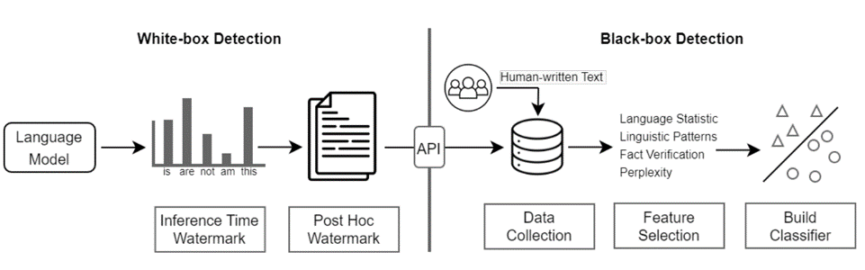

# Detecting-Generated-Abstract

Dr. Jiang Feng. 

The Chinese University Of Hong Kong, Shenzhen

jeffreyjiang@cuhk.edu.cn

# Introduction

Welcome to this project! You're about to detect text generated by advanced large-scale language models (such as ChatGPT). In this project, you'll explore the fascinating world of natural language processing as you work to identify and analyze text generated by a state-of-the-art language model.

Building a ChatGPT detector is an essential task because as language models like ChatGPT become more advanced, it becomes increasingly difficult to distinguish between text generated by humans and text generated by AI models. This is especially important when the text is used to make crucial decisions in financial markets, healthcare, or legal proceedings.

By developing techniques to detect text generated by ChatGPT, you'll be contributing to the ongoing effort to ensure that language models like ChatGPT are used responsibly and ethically. Your work on this project has important implications for language technology's future and can help prevent the misuse of AI-generated text.

We're excited to see the results of your project and look forward to the new insights you'll discover along the way. Good luck!

# Task Definition

Given a dataset of text samples, the goal is to build a detector that can classify each sample as either human-written or AI-generated. The detector will be trained using a pre-trained language model, such as BERT or Roberta.

The whole process will involve the following steps:

Data preparation: The text samples in the dataset will be preprocessed, including tokenization and normalization, to prepare them for input to the pre-trained language model.

Fine-tuning the pre-trained language model: The pre-trained language model will be fine-tuned on text classification, using a labeled dataset of human-written and AI-generated text. The fine-tuning process will involve adjusting the parameters of the pre-trained language model to improve its ability to classify text as human-written or AI-generated.

Evaluation: The fine-tuned language model will be evaluated on a holdout dataset to measure its accuracy, precision, recall, and F1 score in detecting AI-generated text.

Testing: Finally, the fine-tuned language model will be used to classify new text samples as human-written or AI-generated.

By formulating the detection task as a text classification problem and fine-tuning a pre-trained language model on this task, we can build a detector that is capable of accurately detecting AI-generated text.

# Related work

[The Science of LLM-generated Text Detection](https://drive.google.com/file/d/1U8oQNU4f-1c4hJG9vdFuV4xfa10mrKXC/view?usp=sharing) gives a comprehensive survey, and you will learn the research line for detecting AI-generated text.


Here are some popular detectors and related papers:

1. [GPT-2 output detector](https://openai-openai-detector.hf.space/) and [related paper](https://d4mucfpksywv.cloudfront.net/papers/GPT_2_Report.pdf).
2. [ai-text-classifier](https://platform.openai.com/ai-text-classifier) and [related blog](https://platform.openai.com/ai-text-classifier).
3. [GPT-ZERO](https://gptzero.me/) and [related blog](https://www.digitaltrends.com/computing/gptzero-how-to-detect-chatgpt-plagiarism/#dt-heading-how-does-gptzero-work).
4. [DetectGPT](https://detectgpt.ericmitchell.ai/) and [related paper](https://arxiv.org/pdf/2301.11305v1.pdf).
5. [ChatGPT detector](https://huggingface.co/spaces/Hello-SimpleAI/chatgpt-detector-single) and [related paper](https://arxiv.org/pdf/2301.07597.pdf).

# DataSet
Our dataset is sourced from HC3-English. 

Since there was no publicly available dataset split mentioned in the paper, we have divided the dataset into a typical 80% training set and 20% test set, with 10% of the training set reserved for validation set. 

The preprocessing step is shown in preprocess.py. 

You just need to download the [all.jsonl](https://huggingface.co/datasets/Hello-SimpleAI/HC3/blob/main/all.jsonl) into ./dataset from [HC3-English](https://huggingface.co/datasets/Hello-SimpleAI/HC3/tree/main).

# Baseline
Please note: The sample code below assumes that your machine has a GPU that can be used.

In this project, we reproduce the detector following [ChatGPT detector](https://huggingface.co/spaces/Hello-SimpleAI/chatgpt-detector-single), which is an open-source detector for ChatGPT.

We provided the modified code in this project for training and testing detector model.

You can follow the guideline to reproduce it.

# Guideline

The detector is a Roberta for classification model with labels (0: human, 1:ChatGPT).

If you want to train it, follow these steps:

1. install the environment

```bash
pip install -r requirements.txt
```

One thing you have to pay attention to is you should install the proper version of the torch according to your machine. 

2. prepare the data

Download the all.jsonl into ./dataset

Split the data into train set, validate set and test set:

```bash
python preprocess.py
```

3. train
```bash
python train.py
```

Please read the code in this file carefully if you want to know how to train and test the model in detail.

4. get the detector

The ```best_model.pt``` is the trained detector.

You can test the custom sample in text_test.txt (only three examples in it):

```bash
python test.py
```

# Potential task

If you successfully finish the training, you will get a detector with >99% accuracy in the test set, which is ready to be applied in practice.

However, I suggest you take a further step considering the following issues because there are still many challenges that need to be addressed urgently.

Firstly, **there is the issue of interpretability**. Although the constructed detector can achieve very high accuracy, it is unclear what features of the AI-generated text it captures. We hope to explain better the reasons for the judgments through methods such as visualizing attention.

Secondly, **there is the issue of generalizability**. According to our preliminary experiments, even though the detector performs well on the HC3 dataset, its performance drops to around 57% accuracy when we apply it to a dataset generated by a language model trained on a paper polishing task. This indicates that the detector's generalizability is not sufficient. Therefore, we hope to enhance the detector's performance on detections from different datasets and models.

Thirdly, **there is the issue of the detector's robustness**. The current model can detect text generated entirely by humans and text wholly generated by ChatGPT. However, can the detector still accurately detect it if we manually modify the text generated by ChatGPT? Additionally, we want to investigate whether the detector can indicate the degree of modification.

Furthermore, other critical issues related to the detection of text generated by AI and humans can be explored and addressed if you are interested.

# 0330 Update
After you reproduced the baseline, I provided the validation set of the polished abstract dataset (abstract) for you to test your model's generalization.

I also suggest you read papers in recent advanced of AI-generated text detection if you are interested.

Some interesting opinions are proposed.
1. [Can AI-Generated Text be Reliably Detected?](https://arxiv.org/pdf/2303.11156.pdf)
2. [Paraphrasing evades detectors of AI-generated text, but retrieval is
an effective defense](https://arxiv.org/pdf/2303.13408v1.pdf)